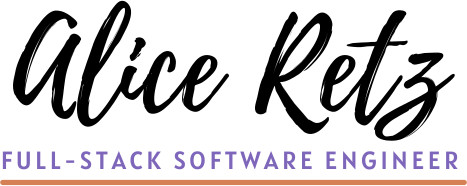

> Creativity | Empathy | Dedication 
<
I'm a software engineer with a keen eye for design and passion for accessibility. Combining design and compassion, I aim to bring intuitive and easy to use customer-facing UI/UX solutions. I like to find simple solutions to complicated problems. Working with a small, close-knit team is my preference and I also enjoy the diversity of ideas that comes with working in a large group. I have experience in customer-facing design and implementation with minimal guidance. I love learning and am always looking for opportunities to broaden my horizons.

## Tech Stack

